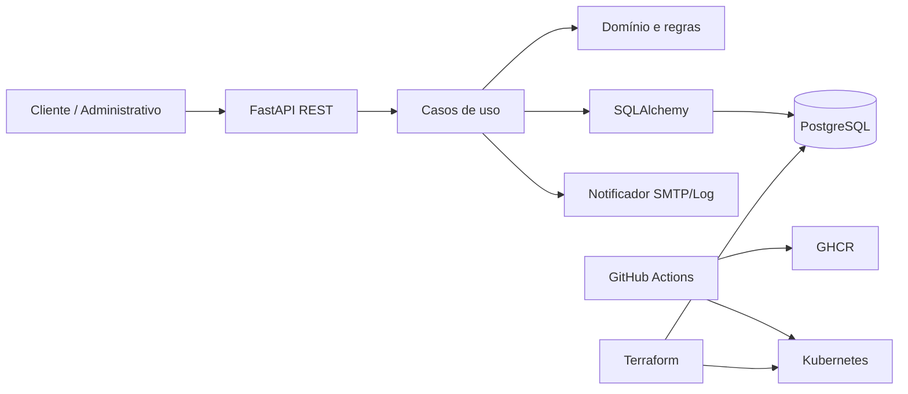
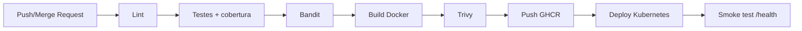

# Arquitetura da solução

## Decisão arquitetural

A aplicação evoluiu do monólito em camadas da Fase 1 para um **monólito modular orientado por Clean Architecture**. O domínio contém regras independentes de framework; a camada de aplicação coordena casos de uso; infraestrutura implementa persistência, autenticação e notificações; apresentação expõe a API REST.

## Fluxo de deploy

## Escalabilidade e resiliência

O Deployment inicia com duas réplicas. O HPA varia entre 2 e 8 réplicas por CPU e memória. Readiness e liveness probes evitam envio de tráfego a pods indisponíveis. Requests e limits tornam o comportamento do HPA previsível.
