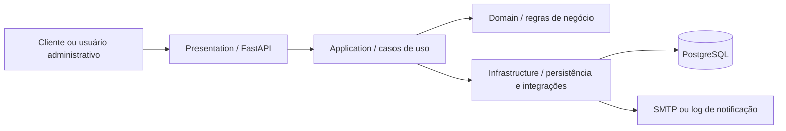
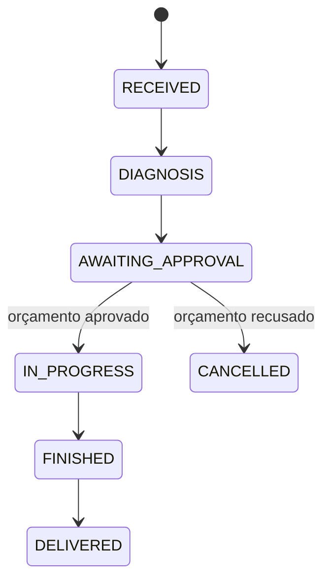

# Arquitetura da aplicação

## Contexto da evolução

A primeira versão foi construída como um monólito em camadas. Para a Fase 2, a aplicação continua monolítica, porém passa a adotar separação inspirada em **Clean Architecture**. A decisão preserva a simplicidade operacional do MVP e reduz o acoplamento entre regras de negócio, API e banco de dados.

## Componentes



### Domain

Contém os estados da ordem de serviço e as regras de transição. Não depende de FastAPI, SQLAlchemy ou detalhes de infraestrutura.

### Application

Coordena abertura de ordens, aprovação de orçamento, atualização de status, consulta e ordenação da fila operacional.

### Infrastructure

Implementa persistência com SQLAlchemy, configuração, autenticação JWT e o mecanismo de notificação.

### Presentation

Expõe os endpoints REST, valida os contratos de entrada e converte erros de negócio em respostas HTTP adequadas.

## Dependências

A regra adotada é que as camadas externas podem usar as internas, mas o domínio não conhece banco de dados ou protocolo HTTP.

```text
presentation → application → domain
                  ↓
            infrastructure
```

## Decisões técnicas

### Monólito modular

A carga prevista para o MVP não justifica microsserviços. O monólito modular reduz custo operacional e mantém os limites internos claros para futuras evoluções.

### PostgreSQL

A aplicação possui relacionamentos fortes entre cliente, veículo, serviços, peças, orçamento e ordem de serviço. O PostgreSQL oferece integridade referencial e transações adequadas para estoque e orçamento.

### Atualização de status

As transições não são livres. A aplicação valida cada mudança para impedir saltos incoerentes no fluxo operacional.

### Notificação

Quando há SMTP configurado, a mudança de status gera e-mail. Em desenvolvimento, o mesmo evento é registrado em log, permitindo demonstrar o requisito sem depender de um provedor externo.

## Fluxo principal



## Preparação para a infraestrutura

A aplicação já disponibiliza `/health`, `/ready` e `/metrics`. Esses endpoints serão usados posteriormente pelas probes do Kubernetes, pelo HPA e pelos smoke tests do pipeline.
